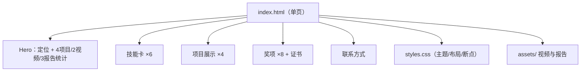

# 尤译庆 · 嵌入式项目作品集与项目导航

> 我的 GitHub 总入口：一个零依赖的静态作品集站点，串起 6 个核心仓库。读者从这里可以看到我的项目全景，点进任意一个仓库都有配套的「项目设计总结 README + docs/interview/ 深度文档」。

| 项目速览 | 内容 |
|---|---|
| 核心平台 | GitHub Pages（静态站，无 JS / 无框架 / 无构建） |
| 开发语言 | HTML5 / CSS3 |
| 部署 | main 分支直发，`.nojekyll` 关闭 Jekyll，HTTPS 已上线 |
| 我的职责 | 站点独立设计与实现、4 个项目的内容整理（视频/报告）、奖项与联系方式组织 |
| 项目状态 | 已上线：`https://meminehobe24435-cmyk.github.io/`（HTTP 200） |

## 1. 项目简介

嵌入式项目的实物很难在简历上被看到。这个站点把 4 个项目的**演示视频与完整报告**放到一个链接里，让 HR/读者点开就能"看"到项目，而不是只读文字。站点同时是**我全部 GitHub 仓库的导航入口**（见下方项目卡片）。

## 2. 项目演示 / 效果

- 线上地址：`https://meminehobe24435-cmyk.github.io/`
- 内容规模：4 个项目、2 段演示视频（约 38.5 MB）、3 份 PDF 报告（约 13.4 MB）、6 张技能卡、8 项奖项
- 站点上的 4 个项目（双目视觉处理系统、CH585 三模无线鼠标、简易自瞄装置、运动目标控制与自动追踪系统）目前**没有公开代码仓库**（仅有视频与报告）【待本人确认】；我的真实代码仓库见下方卡片区

## 3. 我的项目全景（导航卡片）

| 项目 | 一句话定位 | 核心平台 | 入口 |
|---|---|---|---|
| 🚀 **esp-recorder**（主项目） | 双路串口 WiFi 数据记录仪：UART 采集→环形缓冲→SD 落盘，USB 取数 + Web 监控 | ESP32-S3 / FreeRTOS | [仓库](https://github.com/meminehobe24435-cmyk/esp-recorder) |
| ⚙️ **uav-car-adhesion-platform** | 无人机贴面小车的 STM32 底盘固件 + PX4 覆盖层 | STM32F103RCT6 / 裸机 | [仓库](https://github.com/meminehobe24435-cmyk/uav-car-adhesion-platform) |
| 🔧 **ac632n-dev-tools** | 杰理 AC632N 蓝牙开发工具集：构建/烧录/UART 日志/GUI/低功耗 | AC6321A / Python+bat | [仓库](https://github.com/meminehobe24435-cmyk/ac632n-dev-tools) |
| 🤖 **mechanical-arm-project** | 喷涂机器人末端空间定位固件（接触项目，源码加密） | GD32F303CC / Modbus | [仓库](https://github.com/meminehobe24435-cmyk/mechanical-arm-project)（私有） |
| 📋 **YouZeqing** | 实习工作日志 + 研发日报 Skill 与 Python 校验器 | Python / GitHub Actions | [仓库](https://github.com/witrobot/YouZeqing)（私有） |
| 🖥️ **本仓库** | 作品集站点本身（你现在看的这份 README 所属） | HTML/CSS / GitHub Pages | — |

## 4. 站点技术栈

| 类型 | 技术 | 说明 |
|---|---|---|
| 结构 | HTML5 语义化标签 | header/nav/section/article，利于可访问性与 SEO |
| 样式 | CSS 变量 + Grid + clamp() | 暗色主题、流式字号、无框架实现响应式 |
| 响应式 | @media 760px / 480px 两断点 | 多栏卡片在窄屏塌缩为单栏 |
| 媒体 | MP4（H.264/H.265）+ PDF 1.7 | 视频 preload="metadata" 控首屏带宽 |
| 安全 | target="_blank" rel="noreferrer" | 防 reverse tabnabbing |
| 部署 | GitHub Pages + .nojekyll | 二进制媒体原样输出 |

## 5. 站点架构



## 6. 核心数据流（资源加载）

```
浏览器请求 index.html → 解析 → 拉取 styles.css → 视频按 preload="metadata" 只取元数据
→ 用户点击播放才拉视频数据 → PDF 点击后新标签打开
```

- 首屏只加载 HTML+CSS+元数据，把约 50 MB 媒体的成本推迟到用户主动触发；
- `.nojekyll` 保证 MP4/PDF 不被 Jekyll 改写路径。

## 7. 核心模块讲解

### 7.1 内容组织
4 个项目卡片 = 标签（技术方向）+ 一句话定位 + 演示入口（视频/报告）。顺序按完成度排：双目视觉（视频+报告）→ CH585 鼠标（视频）→ 自瞄（报告）→ 追踪（报告）。

### 7.2 技能与奖项背书
技能卡与简历技能区同源；奖项按等级排（国家一等奖在前）。作用是让 HR 在一屏内完成"能力 + 成果"的双重判断。

### 7.3 可访问性
lang="zh-CN"、aria-label（导航/视频/联系方式）、viewport、meta description 均已就位。

## 8. ⭐ 核心代码导览

| 文件 | 作用 | 推荐程度 |
| --- | --- | --- |
| [index.html](index.html) | 单页结构、语义化区块、项目与奖项内容 | ⭐⭐⭐⭐⭐ |
| [styles.css](styles.css) | 主题变量、Grid、响应式断点 | ⭐⭐⭐⭐⭐ |
| [assets/videos/binocular-vision.mp4](assets/videos/binocular-vision.mp4) | 双目视觉演示视频 | ⭐⭐⭐⭐ |
| [assets/reports/binocular-vision-report.pdf](assets/reports/binocular-vision-report.pdf) | 代表报告（66 页） | ⭐⭐⭐⭐ |

## 9. 技术难点与问题

- **大媒体与首屏的矛盾**：preload="metadata" + 点击加载解决；后续可加 poster 封面与懒加载；
- **无构建工具下的可维护性**：靠语义化 + CSS 变量控制复杂度；页面规模再大应引入静态生成；
- **门面与代码脱节（最大问题，如实）**：站点展示的 4 个项目没有公开代码仓库，而我的真实代码仓库此前没有出现在站点上——本 README 的项目卡片区已把 6 个仓库串起来，站点页面本身后续也应同步更新。

## 10. 工程优化

**已实现**：语义化标签、aria、视口适配、preload=metadata、rel=noreferrer、.nojekyll。
**如果重做**：站点页内加项目仓库卡片（与 README 一致）；视频加 poster 并统一 H.264 编码（现有 H.265 存在浏览器兼容风险）；补 favicon/OG 元数据；考虑懒加载与 CDN。

## 11. 👨‍💻 我的主要工作

- 站点独立设计与实现（index.html + styles.css，3 次 commit 单人维护）；
- 4 个项目的视频/报告整理与挂载；
- 奖项、技能、联系方式的组织。

## 12. 🎯 项目能力映射

| 能力 | 体现 |
|---|---|
| 前端基础 | 语义化 HTML、响应式 CSS、无障碍 |
| 资源优化 | 媒体预加载策略、带宽控制 |
| 内容工程 | 把技术项目翻译成 HR 可读的展示 |
| 版本管理 | Git + GitHub Pages 发布流程 |

## 13. 🗣️ 项目设计总结

**项目摘要**：我做了个零依赖的 GitHub Pages 作品集，把 4 个项目的演示视频和报告放在一个链接里，让读者直接"看"项目；它同时是我 6 个仓库的导航入口。

**核心设计说明**：补充技术点——语义化 HTML、CSS Grid 响应式、视频 preload=metadata 控制首屏带宽、rel=noreferrer 防 tab 劫持，.nojekyll 保证二进制媒体正常发布。

**完整技术说明**：讲"为什么做"（嵌入式项目实物不可见→作品可视化）→ 内容组织（项目/技能/奖项）→ 技术取舍（无框架、带宽策略、无障碍）→ 诚实收尾（站点 4 个项目代码未开源，真实代码仓库在卡片区——用仓库讲技术，用站点做门面）。

## 14. 设计思考与 FAQ

1. **Q：为什么用静态站不用框架？** A：9 个文件、单页展示，框架是负资产；零依赖也意味着零构建、零维护。
2. **Q：H.265 视频的兼容问题？** A：部分浏览器不支持 hvc1，后续统一转 H.264 或提供双编码。
3. **Q：站点项目和 GitHub 仓库为什么对不上？** A：如实——站点是早期作品集，仓库是实习项目；本 README 卡片区已串联，站点页面同步是下一步。
4. **Q：SEO/无障碍做了什么？** A：语义化、aria、meta description、lang；OG/结构化数据是改进项。

## 15. 📎 深入阅读

- [00 项目总览](docs/interview/00_PROJECT_OVERVIEW.md)
- [03 代码讲解](docs/interview/03_CODE_WALKTHROUGH.md)
- [10 技术文档](docs/interview/10_INTERVIEW_QA.md)

## 开发者使用信息

- 本地预览：直接打开 index.html 或 `python -m http.server`；
- 发布：push 到 main，GitHub Pages 自动发布；站点根目录 `.nojekyll` 必须保留；
- 修改：编辑 index.html / styles.css，媒体放 assets/。
