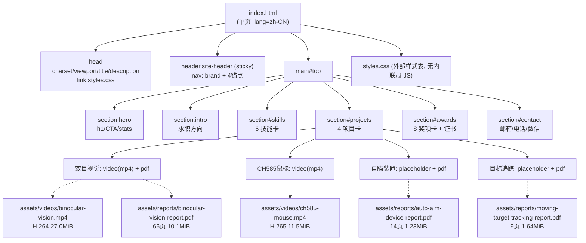
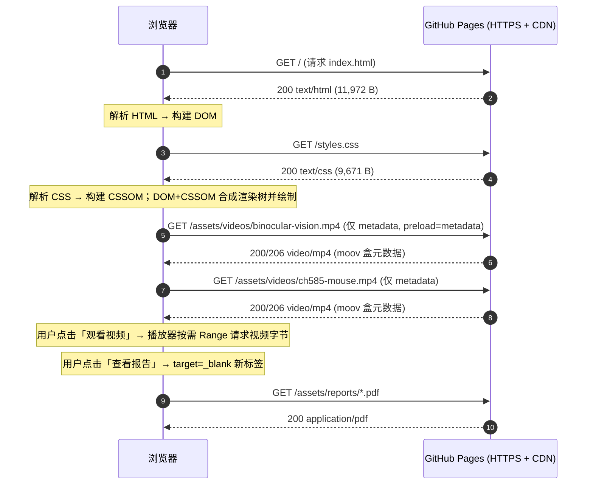
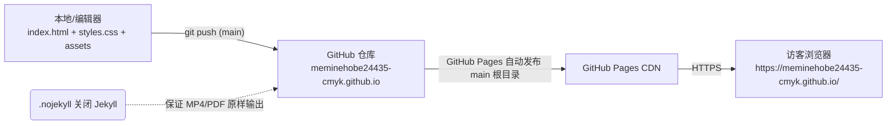

# 02 系统架构（System Architecture）

> 主题：**单页静态站点的「页面结构 + 资源组织 + 加载流程」**。没有后端、没有服务、没有构建产物，架构图围绕「HTML 的区块树」与「浏览器资源请求时序」展开。

## 一、整体结构（页面区块树）

`index.html` 是一个单页（Single-Page）文档，自上而下由 6 个 `<section>` 组成，所有区块都挂在 `<main id="top">` 内，导航通过锚点 `#` 跳转。

- 头部（`<header class="site-header">`，`index.html:14-27`）：粘性导航，含品牌与 4 个锚点链接。
- 主体（`<main id="top">`，`index.html:29`）：
  1. `section.hero`（`:30-60`）：首屏，含主标题、副文案、两个 CTA 按钮、stats 概览。
  2. `section.intro`（`:62-71`）：求职方向。
  3. `section#skills`（`:73-123`）：6 张技能卡。
  4. `section#projects`（`:125-201`）：4 个项目卡（其中 featured 卡带边框高亮）。
  5. `section#awards`（`:203-255`）：8 张奖项卡 + 证书条。
  6. `section#contact`（`:257-279`）：邮箱/电话/微信。



## 二、资源组织（目录树）

```
portfolio-site/
├─ .nojekyll                  # 关闭 Jekyll，二进制原样发布（2B，CRLF）
├─ index.html                 # 单页结构（282 行 / 11,972 B）
├─ styles.css                 # 全部样式（526 行 / 9,671 B）
├─ README.md                  # 仓库说明（667 B）
└─ assets/
   ├─ videos/
   │  ├─ binocular-vision.mp4 # H.264 27.0 MiB → 双目视觉项目
   │  └─ ch585-mouse.mp4      # H.265 11.5 MiB → CH585 鼠标项目
   └─ reports/
      ├─ binocular-vision-report.pdf   # 10.1 MiB / 66 页 → 双目视觉
      ├─ moving-target-tracking-report.pdf # 1.64 MiB / 9 页 → 目标追踪
      └─ auto-aim-device-report.pdf    # 1.23 MiB / 14 页 → 自瞄装置
```

**组织特点（面试可讲）**：
- 按「类型」分目录（`videos/` vs `reports/`），命名用英文小写 + 连字符，与 `index.html` 引用路径严格一致（大小写敏感，避免 Windows 开发 / Linux 部署的路径大小写坑）。
- 媒体与代码分离，`index.html` 只写相对路径引用，本地与线上行为一致。
- 无图片资源：视频卡用 `<video>` 原生控件直接展示，两个「只有报告」的项目用 CSS 占位块（`placeholder-panel`，`styles.css:334-350`）代替缩略图。

## 三、加载流程（时序）

浏览器访问 `https://meminehobe24435-cmyk.github.io/` 的完整资源请求链：



**关键结论（据此回答面试）**：
1. **首屏只加载约 21 KB**（`index.html` 11.9 KB + `styles.css` 9.7 KB）+ 两个视频的 moov 元数据，PDF 完全不加载。因此站点「首屏」很轻，重的是「用户点开视频/报告之后」。
2. **无第三方请求**：不加载任何 CDN 字体、统计脚本、图片 CDN（`styles.css` 字体栈用系统字体 `system-ui/…`，`:33-35`），隐私友好且无外链拖慢。
3. **视频是「渐进下载」而非「流媒体服务器」**：静态 MP4 由浏览器用 HTTP Range 请求按需取数据，`moov` 盒必须位于文件前部（faststart）才能快速起播——这是静态视频部署的关键约定。
4. **锚点导航不产生新请求**：`#projects` 等跳转是同一文档内滚动（配合 `scroll-behavior:smooth`，`styles.css:21`），是「无 SPA 路由的单页体验」。

## 四、部署架构



- 无 `.github/workflows`、无 `CNAME`，故是「**Deploy from a branch → main / (root)**」的默认 GitHub Pages 路径，非 Actions 流水线。
- 每次 `git push` 到 `main` 后由 GitHub Pages 自动重建并发布（这一自动发布机制是 GitHub Pages 的通用行为，本仓库未配置额外钩子，标注为「平台默认行为」）。
