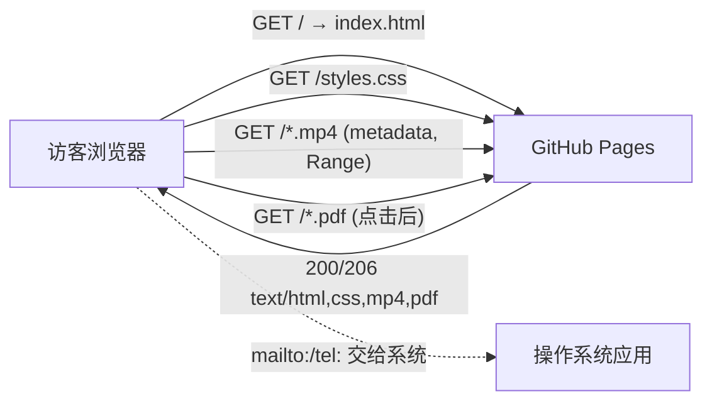

# 05 协议与数据流（资源加载与数据流）

> 站点是纯静态页，**没有网络协议栈、没有前后端通信、没有 API**。因此本模块讲真实主题：**静态资源如何被请求与加载、外链如何工作、视频如何渐进流式播放**。这也是嵌入式候选人在面试里常被问「Web 基础」时能借力讲清的部分。

## 一、本模块的「协议」边界（先定性）

- **有**：HTTP/HTTPS（资源传输）、HTML 锚点（`#` 页内定位，非协议）、`mailto:`/`tel:`（URI scheme，触发系统协议处理器）。
- **无**：WebSocket、HTTP/2 Server Push（不主动使用）、自定义 TCP/UDP 应用协议、REST API、Cookie/Session、跨域 JSON 请求。
- 证据：全文无 `<script>`、无 `fetch`/`XMLHttpRequest`、无 ``、无 `iframe`，唯一网络引用是 `styles.css` 与 `assets/` 资源（`index.html:11,134,145,154,165,181,197`）。

## 二、静态资源请求清单（真实数据流）

| 触发时机 | 请求 | 说明 |
| --- | --- | --- |
| 页面打开 | `GET /` | 拉取 `index.html` |
| HTML 解析到 `<link>` | `GET /styles.css` | 样式表，同步阻塞渲染 |
| 解析到 2 个 `<video>` | `GET /assets/videos/*.mp4`（仅元数据） | `preload="metadata"`，只取 moov |
| 用户点击「观看视频」 | 视频播放器发 `Range` 请求取字节 | 渐进下载 |
| 用户点击「查看报告」 | 新标签 `GET /assets/reports/*.pdf` | 全量下载后交给 PDF 查看器 |
| 用户点击邮箱/电话 | 系统唤起 `mailto:`/`tel:` 处理器 | 不产生站点请求 |

**重要结论**：首屏网络成本 ≈ 11.9 KB(HTML) + 9.7 KB(CSS) + 2 次视频 moov 元数据请求；PDF（合计 13.4 MB）与视频正文（合计 38.5 MB）都不在首屏传输。

## 三、视频的「流式加载」是怎么发生的（关键技术点）

静态 MP4 不是 RTSP/HLS 流，而是 **HTTP 渐进下载（progressive download）**：

1. 浏览器先请求文件头部，读取 `moov` box 里的 track 信息（时长/分辨率/采样表），本站 `preload="metadata"` 只做这一步。
2. 用户点播放后，浏览器按时间戳用 **HTTP `Range` 请求**（`Range: bytes=start-end`）按需拉取 `mdat` 里的音视频数据。
3. 能「边下边播」的前提：`moov` 盒在 `mdat` 之前（即 faststart/优化过）；否则浏览器可能要先下完整文件才能播。
   - 本仓库无法确认导出时是否开启 faststart，标注【待本人确认】——这是面试可主动提到的「我不确定、需用 mp4box/ffprobe 验证」点。

**面试追问（Web 基础，嵌入式候选人常被问）**：
- Q：为什么视频没加载完也能拖动进度条？→ A：`moov` 元数据 + HTTP Range 让浏览器知道「时间戳 ↔ 字节偏移」映射，可按需取对应片段。
- Q：HTTP 200 vs 206 区别？→ A：200 返回完整资源；206 Partial Content 返回 Range 请求的部分字节，是视频拖动/断点续传的基础。

## 四、外链与 `rel="noreferrer"` 的安全意义

所有站外打开的链接（PDF/视频按钮）都带 `target="_blank" rel="noreferrer"`（`index.html:41,145,146,165,181,197`）：
- `target="_blank"` 在新标签打开（PDF/视频不打断浏览）。
- `rel="noreferrer"`：新页面拿不到 `document.referrer`，且**阻止 reverse tabnabbing**（旧页面不被 `window.opener` 反向操控）。
- 注意：`noreferrer` 会同时隐藏来源 referrer；更精细可用 `rel="noopener"`（只防 tabnabbing、保留 referrer）。本站选了 `noreferrer`，属可接受的更保守做法。

## 五、锚点导航的数据流（`#` 不是协议）

- 点击 `#projects` 等：浏览器把 URL hash 改为 `#projects`，**不发起 HTTP 请求**，滚动到对应 `id`。
- `scroll-behavior:smooth`（`styles.css:21`）把默认的「瞬移」改成平滑滚动（CSS 层实现，非 JS）。
- 副作用：hash 会进入历史记录（可后退），这是原生行为。

## 六、`mailto:` / `tel:` URI scheme

- `mailto:meminehobe24435@gmail.com`（`index.html:266`）与 `tel:15629297138`（`:270`）：浏览器把请求交给操作系统注册的邮件客户端/拨号应用，站点本身不传输任何数据。
- 这是「零后端也能建立联系」的静态站方案。

## 七、一张图总结数据流

## 八、面试总结句

> 「这是一个零后端、零 API 的静态站：数据流就是『浏览器请求 HTML → 请求 CSS → 视频按 metadata 预取、按 Range 渐进加载 → 点击后下载 PDF』。它没有应用层协议，但它用对了 HTTP/HTTPS、Range 请求和 URI scheme——这些正是嵌入式设备 Web 配置页/OTA 下载里也会用到的机制。」
