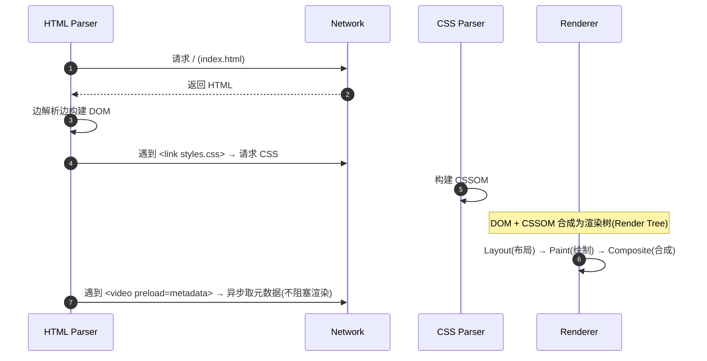

# 06 并发与异常（浏览器渲染 / 资源加载失败 / 兼容性）

> 站点没有多线程、没有并发控制、没有 try/catch。本模块把「并发与异常」翻译成静态站真实对应的三个主题：**浏览器渲染管线（伪并发）**、**资源加载失败与容错**、**兼容性异常（尤其 HEVC）**。

## 一、浏览器渲染管线（站点里的「并发」）

浏览器加载本站时的并行/串行关系：

- **关键点 1**：`<link>` 样式是**渲染阻塞**资源——CSS 未就绪前页面不绘制（避免 FOUC）。本站 CSS 仅 9.7 KB，阻塞代价可忽略。
- **关键点 2**：`<video>` 是**异步、非渲染阻塞**；`preload="metadata"` 进一步限制其网络占用，不参与首屏关键路径。
- **关键点 3**：没有 `<script>` 意味着**没有 JS 执行阻塞**、没有 `defer/async` 问题、没有主线程长任务——这是「无 JS 站点」在性能模型上的天然优势（可作面试亮点）。

## 二、资源加载失败与容错（站点里的「异常处理」）

| 异常场景 | 站点的处理 | 评价 |
| --- | --- | --- |
| 浏览器不支持 `<video>` | `<video>` 内回退文本「当前浏览器不支持视频播放…」（`index.html:135,155`） | 有基础 fallback ✓ |
| 视频文件 404 / 路径错 | 无 `<onerror>` 兜底、无 JS 提示 | 缺增强容错 ✗（浏览器只显示原生错误） |
| PDF 打不开 / 无阅读器 | 新标签交给浏览器，无降级提示 | 中性 |
| 样式表加载失败 | 页面无样式，内容仍可读（语义化 HTML 兜底） | 结构上天然可降级 ✓ |
| CSS 特性不被支持（`backdrop-filter`/`clamp`） | 无 `@supports` 回退 | 渐进增强，但未显式兜底（见下） |
| 邮件/电话协议无关联应用 | `mailto:`/`tel:` 交给系统，无兜底 | 中性 |

**值得讲的面试点**：
1. **语义化 HTML 本身是「异常降级」**：即使 CSS 全挂，`<header>/<nav>/<section>/<article>` 仍按文档流可读，这是「内容与表现分离」带来的健壮性。
2. **缺少 `poster` 使视频区在加载前是黑块**（`poster=""`，`index.html:133`），从「体验容错」看是个已知缺口：应放一张封面图，避免网络慢时视频区长期黑屏。
3. **无 `<noscript>` 诉求**：站点本就不依赖 JS，无需为「禁用 JS」做降级（本身就是全静态可用）。

## 三、兼容性异常（重点：HEVC 视频）

这是本站**最实打实的兼容性风险**，源于两个视频编码不同：

| 视频 | 编码 | 浏览器支持现状 |
| --- | --- | --- |
| `binocular-vision.mp4` | H.264 (`avc1`) | 全主流浏览器原生支持 ✓ |
| `ch585-mouse.mp4` | H.265/HEVC (`hvc1`) | Safari 支持良好；Chrome/Edge 依赖硬件解码器（多数新设备可播）；**Firefox 默认不原生支持 HEVC 播放** ✗ |

- 结论：`ch585-mouse.mp4` 在部分浏览器（尤其 Firefox 老版本、无 HEVC 硬解的机器）可能**无法在 `<video>` 里播放**，此时只会命中回退文本（`:155`），用户无法直接看。
- 面试应对：主动点出「第二个视频用了 HEVC，牺牲兼容性换取约 40% 码率；如果要全平台兼容，应转成 H.264 或提供 WebM/AV1 多源 `<source>`」。这体现「懂编码权衡 + 懂浏览器兼容」。

**通用兼容性清单**：

| 特性 | 兼容风险 | 建议 |
| --- | --- | --- |
| `backdrop-filter` | 老浏览器无毛玻璃 | 无功能影响，可接受 |
| `clamp()` | 老浏览器字号无流式缩放 | 可加固定 `font-size` 兜底 |
| CSS Grid | IE11 仅旧语法 | 目标用户为现代浏览器，可接受 |
| `preload="metadata"` | 老浏览器忽略（回退为 auto） | 可接受 |
| `rel="noreferrer"` | 语义差异（也隐 referrer） | 属保守正确 |

## 四、移动端「异常」与断点行为

- 760px 断点：所有多栏 Grid 改单栏（`styles.css:489-496`），`h1` 字号改用 `clamp(4.5rem,28vw,8rem)`（`:485-487`）。
- 480px 断点：隐藏品牌名文字、按钮全宽（`:514-525`）。
- **未处理**：导航未折叠（无汉堡），320px 下 4 个链接可能拥挤；无 `touch` 优化；视频在移动端点击后可能消耗大量流量（无「仅在 Wi-Fi 提示」等）。

## 五、面试总结句

> 「这个站点的『并发』是浏览器的资源加载并行度——CSS 渲染阻塞、视频异步非阻塞、无 JS 无主线程负担；『异常』体现在回退文本、语义化降级、外链 `noreferrer`，以及一个真实的兼容性点：CH585 视频用了 HEVC，在 Firefox 等环境可能播不了，需要转码或提供多编码源。这些都是我能讲清、也能改的东西。」
