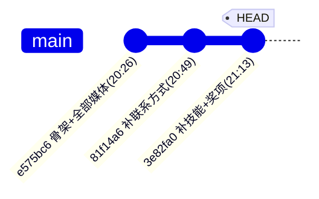

# 14 开发历史（Development History）

> 依据 `git log` 逐 commit 重建站点演进。仓库共 **3 个 commit**，全部发生在 2026-06-12（+0800），作者唯一，单分支 `main`。

## 一、时间线与提交记录

| # | commit（短） | 完整 hash | 时间(+0800) | 信息 | 改动 |
| --- | --- | --- | --- | --- | --- |
| 1 | `e575bc6` | `e575bc6d1d39ec44967574e51e950cd6aaee30e7` | 2026-06-12 20:26:52 | Add project portfolio site | 9 文件 +584 行（初始） |
| 2 | `81f14a6` | `81f14a6bc445f7ca4feeff8d3f5731cae6985820` | 2026-06-12 20:49:08 | Add contact information | `index.html +16/-1`、`styles.css +36/-1` |
| 3 | `3e82fa0` | `3e82fa084854840fb737284451bf0f4aa5f1080f` | 2026-06-12 21:13:18 | Add skills and awards sections | `index.html +108`、`styles.css +94/-1` |

- **HEAD** = `3e82fa084854840fb737284451bf0f4aa5f1080f`。
- **时间跨度**：20:26:52 → 21:13:18，约 **47 分钟**。
- **分支**：仅 `main`（含 `origin/main`、`origin/HEAD`），无 feature/fix 分支、无合并提交、无 revert。

## 二、逐 commit 演进细节

### Commit 1 `e575bc6` —— 一次性搭建骨架 + 全部媒体
- 创建 `.nojekyll`、`README.md`、`index.html`（160 行）、`styles.css`（400 行），并**一次性提交全部 5 个媒体文件**（2 视频 + 3 PDF）。
- 含义：作者在首个 commit 就把「结构 + 样式 + 项目媒体」一起放好，说明站点在**本地已基本成型后才首次入库**，git 里没有「逐步添加媒体」的过程。
- 证据：`git log --stat` 显示该 commit 含 `Bin 0 -> 1286951 bytes` 等 5 条二进制新增。

### Commit 2 `81f14a6` —— 补联系方式
- `index.html` 增加约 16 行（`#contact` 区块：邮箱/电话/微信，`index.html:257-279`）。
- `styles.css` 增加约 36 行（`.contact`、`.contact-list` 等样式，`styles.css:375-377, 430-461`）。
- 含义：首版可能只到「奖项/项目」，作者随后补上了求职者必须的「联系方式」闭环。

### Commit 3 `3e82fa0` —— 补技能 + 奖项
- `index.html` 增加约 108 行（`#skills` 6 张技能卡 + `#awards` 8 张奖项卡 + 证书条，`index.html:73-255`）。
- `styles.css` 增加约 94 行、删 1 行（`.skill-grid`、`.award-board`、`.award-card`、`.cert-strip` 等，`styles.css:262-295, 379-428`）。
- 含义：这是「内容最丰满」的一次，把能力雷达与荣誉背书补上，站点信息结构就此完整。

## 三、演进特征分析（面试可讲）

1. **单会话、快速迭代**：3 个 commit 在 47 分钟内完成，且顺序是「骨架+媒体 → 联系 → 技能+奖项」，符合「先立骨架、再补内容」的合理节奏。
2. **提交粒度良好**：每个 commit 主题单一、可读（「Add …」命名规范），说明有基本的 git 习惯。
3. **媒体「一次到位」**：视频/报告从首个 commit 就固定，此后无转码/替换记录 → 媒体是「成品导入」，不是「在仓库里迭代」。
4. **无后续维护**：2026-06-12 之后再无提交，而作者其余代码仓库在 2026-08 才创建 → 站点是「早期门面」，后续的工程交付没有回流到站点。
5. **无 bug-fix 提交**：历史里没有可证实的线上故障/修复记录（不代表没遇到，只是未体现在 git）。

## 四、演进示意图

（注：单分支线性历史，无合并/无 tag；`3e82fa0` 即当前 `main`。）

## 五、一句话总结

> 「这个站点是在 2026 年 6 月 12 日晚上用约 47 分钟、3 次提交搭建完成的：先放骨架和全部项目媒体，再补联系方式，最后补技能和奖项。它是我的作品集『门面』；之后到 8 月我才陆续把实习记录仪、无人机小车等代码整理到独立仓库，站点还没回链这些仓库——这是时间线留下的一个真实待办。」
